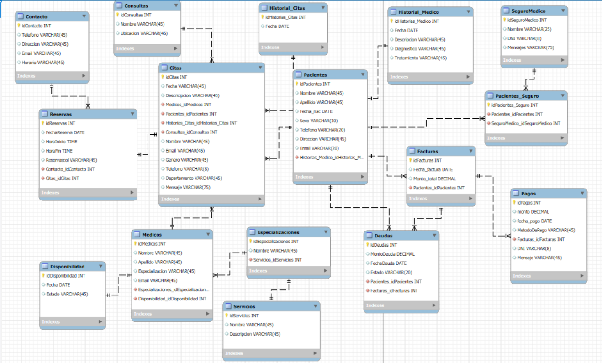

# 🏥 Sistema de Gestión Hospitalaria 🏥

## 📄 Documentación del Proyecto 📄

### Enlace al prototipo en Figma

Puedes acceder al prototipo del sistema en Figma a través del siguiente enlace:  
[🔗 Accede al proyecto en Figma aquí](https://www.figma.com/design/tfYFB0tPnSADpT1VJvIpiw/PROYECTO-BASE-DATOS?node-id=147-1780&t=6NQBMuX3qzSt46Qc-1)

### Tabla de Contenidos

1. [📄 Introducción](#📄-introducción)
2. [🎯 Objetivo del Proyecto](#🎯-objetivo-del-proyecto)
3. [📌 Funcionalidades Principales](#📌-funcionalidades-principales)
4. [📂 Módulos del Sistema](#📂-módulos-del-sistema)
5. [🗂️ Estructura de la Base de Datos](#🗂️-estructura-de-la-base-de-datos)
6. [🛠️ Tecnologías Utilizadas](#🛠️-tecnologías-utilizadas)
7. [📊 Diagramas del Sistema](#📊-diagramas-del-sistema)
8. [📚 Conclusiones y Próximos Pasos](#📚-conclusiones-y-próximos-pasos)

---

## 📄 Introducción

El **Sistema de Gestión Hospitalaria** es una solución diseñada para mejorar los procesos administrativos y clínicos de un hospital. Este sistema permite gestionar pacientes, médicos, citas, historiales médicos, facturación y más, de manera eficiente y centralizada.

---

## 🎯 Objetivo del Proyecto

El objetivo principal del proyecto es **automatizar y centralizar la gestión hospitalaria**. Esto incluye:

- Facilitar el manejo de datos de pacientes y médicos.
- Optimizar la programación de citas.
- Mejorar la trazabilidad del historial médico.
- Aumentar la eficiencia en la facturación y los pagos.

---

## 📌 Funcionalidades Principales

- **Gestión de Pacientes:** Registro y edición de información personal y médica.
- **Historial Médico:** Consulta y almacenamiento de diagnósticos y tratamientos.
- **Citas:** Programación, reprogramación y cancelación de citas médicas.
- **Facturación:** Generación y seguimiento de facturas, gestión de deudas y pagos.
- **Gestión de Personal Médico:** Registro de médicos y sus especializaciones.
- **Reportes:** Generación de reportes detallados sobre la actividad del hospital.

---

## 📂 Módulos del Sistema

| **Módulo**           | **Descripción**                                                              |
| -------------------- | ---------------------------------------------------------------------------- |
| **Pacientes**        | Registro, consulta y gestión de la información personal y médica.            |
| **Médicos**          | Gestión de personal médico, especializaciones y horarios.                    |
| **Citas**            | Gestión de programación y asignación de citas médicas.                       |
| **Historial Médico** | Almacenamiento de diagnósticos, tratamientos y resultados de consultas.      |
| **Facturación**      | Gestión de facturas, pagos y estado de deudas de los pacientes.              |
| **Seguros Médicos**  | Integración de pacientes con compañías aseguradoras y gestión de coberturas. |

---

## 🗂️ Estructura de la Base de Datos

### 📊 Esquema General

-- **Pacientes**

- IdPacientes NUMBER PRIMARY KEY
- Nombre VARCHAR2(45)
- Apellido VARCHAR2(45)
- Fecha_nac DATE
- Sexo VARCHAR2(10)
- Teléfono VARCHAR2(20)
- Dirección VARCHAR2(45)
- Email VARCHAR2(20)
- Historias_Medico_idHistorias_Medico NUMBER, FOREIGN KEY (Historias_Medico_idHistorias_Medico) REFERENCES Historias_Medico(IdHistorias_Medico)

-- **Médicos**

- IdMedicos NUMBER PRIMARY KEY
- Nombre VARCHAR2(45)
- Apellido VARCHAR2(45)
- Especialización VARCHAR2(45)
- Email VARCHAR2(45)
- Especializaciones_idEspecializaciones NUMBER, FOREIGN KEY (Especializaciones_idEspecializaciones) REFERENCES Especializaciones(IdEspecializaciones)
- Disponibilidad_idDisponibilidad NUMBER, FOREIGN KEY (Disponibilidad_idDisponibilidad) REFERENCES Disponibilidad(IdDisponibilidad)

-- **Citas**

- IdCitas NUMBER PRIMARY KEY
- Fecha DATE
- Descripción VARCHAR2(45)
- Pacientes_idPacientes NUMBER, FOREIGN KEY (Pacientes_idPacientes) REFERENCES Pacientes(IdPacientes)
- Medicos_idMedicos NUMBER, FOREIGN KEY (Medicos_idMedicos) REFERENCES Medicos(IdMedicos)
- Consultas_idConsultas NUMBER, FOREIGN KEY (Consultas_idConsultas) REFERENCES Consultas(IdConsultas)

-- **Consultas**

- IdConsultas NUMBER PRIMARY KEY
- Nombre VARCHAR2(45)
- Ubicación VARCHAR2(45)

-- **Historial_Medico**

- IdHistorias_Medico NUMBER PRIMARY KEY
- Fecha DATE
- Descripción VARCHAR2(45)
- Diagnóstico VARCHAR2(45)
- Tratamiento VARCHAR2(45)

-- **Reservas**

- IdReservas NUMBER PRIMARY KEY
- FechaReserva DATE
- HorarioInicio DATE
- HorarioFin DATE
- ReservadoPor VARCHAR2(45)
- Contacto_idContacto NUMBER, FOREIGN KEY (Contacto_idContacto) REFERENCES Contacto(IdContacto)
- Citas_idCitas NUMBER, FOREIGN KEY (Citas_idCitas) REFERENCES Citas(IdCitas)

-- **Disponibilidad**

- IdDisponibilidad NUMBER PRIMARY KEY
- Fecha DATE
- Estado VARCHAR2(45)

-- **Facturas**

- IdFacturas NUMBER PRIMARY KEY
- Fecha_factura DATE
- Monto_total NUMBER(10, 2)
- Pacientes_idPacientes NUMBER, FOREIGN KEY (Pacientes_idPacientes) REFERENCES Pacientes(IdPacientes)

-- **Deudas**

- IdDeudas NUMBER PRIMARY KEY
- FechaDeuda DATE
- MontoDeuda NUMBER(10, 2)
- Estado VARCHAR2(20)
- Pacientes_idPacientes NUMBER, FOREIGN KEY (Pacientes_idPacientes) REFERENCES Pacientes(IdPacientes)
- Facturas_idFacturas NUMBER, FOREIGN KEY (Facturas_idFacturas) REFERENCES Facturas(IdFacturas)

-- **Pagos**

- IdPagos NUMBER PRIMARY KEY
- Monto NUMBER(10, 2)
- Fecha_pago DATE
- MetodoDePago VARCHAR2(45)
- DNI VARCHAR2(8)
- Mensaje VARCHAR2(45)
- Facturas_idFacturas NUMBER, FOREIGN KEY (Facturas_idFacturas) REFERENCES Facturas(IdFacturas)

-- **Seguros Médicos**

- IdSeguroMedico NUMBER PRIMARY KEY
- Nombre VARCHAR2(25)
- DNI VARCHAR2(8)
- Mensajes VARCHAR2(75)

-- **Pacientes_Seguro**

- IdPacientes_Seguro NUMBER PRIMARY KEY
- Pacientes_idPacientes NUMBER, FOREIGN KEY (Pacientes_idPacientes) REFERENCES Pacientes(IdPacientes)
- SeguroMedico_idSeguroMedico NUMBER, FOREIGN KEY (SeguroMedico_idSeguroMedico) REFERENCES Seguros_Medicos(IdSeguroMedico)

-- **Especializaciones**

- IdEspecializaciones NUMBER PRIMARY KEY
- Nombre VARCHAR2(45)
- Servicios_idServicios NUMBER, FOREIGN KEY (Servicios_idServicios) REFERENCES Servicios(IdServicios)

-- **Servicios**

- IdServicios NUMBER PRIMARY KEY
- Nombre VARCHAR2(45)
- Descripción VARCHAR2(45)

-- **Contacto**

- IdContacto NUMBER PRIMARY KEY
- Teléfono VARCHAR2(45)
- Dirección VARCHAR2(45)
- Email VARCHAR2(45)
- Horario VARCHAR2(45)

---

## Relaciones Principales

1. **Pacientes** se relaciona con:

   - **Citas**
   - **Historial Médico**
   - **Facturas**, **Deudas**, **Pagos**
   - **Pacientes_Seguro**

2. **Médicos** se relaciona con:

   - **Citas**
   - **Especializaciones**
   - **Disponibilidad**

3. **Citas** se conecta a:

   - **Pacientes**, **Médicos**
   - **Consultas**
   - **Reservas**

4. **Facturas**, **Deudas**, y **Pagos** tienen una relación financiera:

   - Ligados a **Pacientes**

5. **Seguros Médicos** se relacionan con:

   - **Pacientes_Seguro**

6. **Servicios** y **Especializaciones** están relacionados con:

   - **Médicos**.

7. **Reservas** está relacionada con:

   - **Citas**
   - **Contacto**

8. **Disponibilidad** está asociada a:
   - **Médicos**

---

## 🛠️ Tecnologías Utilizadas

| **Tecnología** | **Uso**                                              |
| -------------- | ---------------------------------------------------- | --- |
| **Oracle**     | Gestión de la base de datos relacional.              |
| **Figma**      | Para poder hacer el vosquejo de como se veria mi wed |     |

---

## 🚀 Instalación y Configuración

### 🔧 Requisitos

1. **Oracle SQL Developer**[🔗 Enlace](https://www.oracle.com/pe/database/sqldeveloper/technologies/download/)
2. **Figma**[🔗 Enlace](https://www.figma.com/downloads/)

# Diagrama Entidad-Relación

Este es un resumen completo de las tablas y relaciones de la base de datos del sistema de gestión hospitalaria.

---

## 📊 Diagramas del Sistema

Aquí se presentan los diagramas del sistema que ilustran la estructura de las tablas y las relaciones entre ellas.

# Tablas y Atributos

#### **Pacientes**

- **IdPacientes** (NUMBER, PK)
- Nombre (VARCHAR2(45))
- Apellido (VARCHAR2(45))
- Fecha_nac (DATE)
- Sexo (VARCHAR2(10))
- Teléfono (VARCHAR2(20))
- Dirección (VARCHAR2(45))
- Email (VARCHAR2(20))
- **Historias_Medico_idHistorias_Medico** (NUMBER, FK)

#### **Médicos**

- **IdMedicos** (NUMBER, PK)
- Nombre (VARCHAR2(45))
- Apellido (VARCHAR2(45))
- Especialización (VARCHAR2(45))
- Email (VARCHAR2(45))
- **Especializaciones_idEspecializaciones** (NUMBER, FK)
- **Disponibilidad_idDisponibilidad** (NUMBER, FK)

#### **Citas**

- **IdCitas** (NUMBER, PK)
- Fecha (DATE)
- Descripción (VARCHAR2(45))
- **Pacientes_idPacientes** (NUMBER, FK)
- **Medicos_idMedicos** (NUMBER, FK)
- **Consultas_idConsultas** (NUMBER, FK)

#### **Consultas**

- **IdConsultas** (NUMBER, PK)
- Nombre (VARCHAR2(45))
- Ubicación (VARCHAR2(45))

#### **Historial_Medico**

- **IdHistorias_Medico** (NUMBER, PK)
- Fecha (DATE)
- Descripción (VARCHAR2(45))
- Diagnóstico (VARCHAR2(45))
- Tratamiento (VARCHAR2(45))

#### **Reservas**

- **IdReservas** (NUMBER, PK)
- FechaReserva (DATE)
- HorarioInicio (TIMESTAMP)
- HorarioFin (TIMESTAMP)
- ReservadoPor (VARCHAR2(45))
- **Contacto_idContacto** (NUMBER, FK)
- **Citas_idCitas** (NUMBER, FK)

#### **Disponibilidad**

- **IdDisponibilidad** (NUMBER, PK)
- Fecha (DATE)
- Estado (VARCHAR2(45))

#### **Facturas**

- **IdFacturas** (NUMBER, PK)
- Fecha_factura (DATE)
- Monto_total (NUMBER(10, 2))
- **Pacientes_idPacientes** (NUMBER, FK)

#### **Deudas**

- **IdDeudas** (NUMBER, PK)
- FechaDeuda (DATE)
- MontoDeuda (NUMBER(10, 2))
- Estado (VARCHAR2(20))
- **Pacientes_idPacientes** (NUMBER, FK)
- **Facturas_idFacturas** (NUMBER, FK)

#### **Pagos**

- **IdPagos** (NUMBER, PK)
- Monto (NUMBER(10, 2))
- Fecha_pago (DATE)
- MetodoDePago (VARCHAR2(45))
- DNI (VARCHAR2(8))
- Mensaje (VARCHAR2(45))
- **Facturas_idFacturas** (NUMBER, FK)

#### **Seguros Médicos**

- **IdSeguroMedico** (NUMBER, PK)
- Nombre (VARCHAR2(25))
- DNI (VARCHAR2(8))
- Mensajes (VARCHAR2(75))

#### **Pacientes_Seguro**

- **IdPacientes_Seguro** (NUMBER, PK)
- **Pacientes_idPacientes** (NUMBER, FK)
- **SeguroMedico_idSeguroMedico** (NUMBER, FK)

#### **Especializaciones**

- **IdEspecializaciones** (NUMBER, PK)
- Nombre (VARCHAR2(45))
- **Servicios_idServicios** (NUMBER, FK)

#### **Servicios**

- **IdServicios** (NUMBER, PK)
- Nombre (VARCHAR2(45))
- Descripción (VARCHAR2(45))

#### **Contacto**

- **IdContacto** (NUMBER, PK)
- Teléfono (VARCHAR2(45))
- Dirección (VARCHAR2(45))
- Email (VARCHAR2(45))
- Horario (VARCHAR2(45))

## 📚 Conclusiones y Próximos Pasos

- **Conclusiones:** Este diagrama muestra la estructura de una base de datos relacional con tablas que gestionan tanto los aspectos médicos como administrativos del hospital o clínica, permitiendo llevar un control de los pacientes, citas, facturas y pagos, así como los seguros médicos y las especializaciones.
- **Próximos pasos:** A medida que este sistema crezca, se podría considerar agregar funcionalidades como la integración con sistemas de facturación externa, control de inventarios médicos, y una interfaz de usuario más robusta.

---

## Relaciones Principales

1. **Pacientes** se relaciona con:

   - **Citas**
   - **Historial Médico**
   - **Facturas**, **Deudas**, **Pagos**
   - **Pacientes_Seguro**

2. **Médicos** se relaciona con:

   - **Citas**
   - **Especializaciones**
   - **Disponibilidad**

3. **Citas** se conecta a:

   - **Pacientes**, **Médicos**
   - **Consultas**
   - **Reservas**

4. **Facturas**, **Deudas**, y **Pagos** tienen una relación financiera:

   - Ligados a **Pacientes**

5. **Seguros Médicos** se relacionan con:

   - **Pacientes_Seguro**

6. **Servicios** y **Especializaciones** están relacionados con:

   - **Médicos**.

7. **Reservas** está relacionada con:

   - **Citas**
   - **Contacto**

8. **Disponibilidad** está asociada a:
   - **Médicos**
